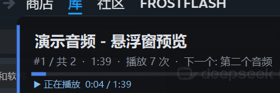

<h1>纯vibe制作，无任何人工干预</h1>
# Soundpad HUD — 置顶悬浮窗（显示当前选中的音频名称）

一个独立的 Windows 悬浮窗小工具，常驻置顶显示 **Soundpad 当前选中的音频名称**，
并额外显示正在播放的曲目与进度条。它 **不修改 Soundpad**，只通过 Soundpad 官方
提供的远程控制接口（命名管道 `\\.\pipe\sp_remote_control`）通信。



> 第一行 = 当前选中音频名 · 第二行 = 序号 / 时长 / 播放次数 / 下一个音频 · 第三行 = 播放进度条 · 第四行 = 快捷键提示

---

## 1. 为什么是"悬浮窗自己管选中"

Soundpad 4.0.34 的官方接口（RC 1.1.2）**没有任何命令可以读取"当前选中行"**：

| 能读到的 | 读不到的 |
|---|---|
| 声音列表（名称/索引/时长/播放次数）、类别树 | **当前选中了哪一行** |
| 播放状态、播放进度、时长、音量 | 选中行的名称 |
| `GetTitleText()` 恒为 `Soundpad`；`GetStatusBarText()` 为空 | |

而且 Soundpad 的声音列表是 wxWidgets 自绘控件，所有控件的
`WM_GETOBJECT` 都返回 0，即 **UIA / MSAA 辅助功能完全读不到它**
（界面上只有"已选择: N"这个数字，没有名字）。

所以本工具采用的方案是：**悬浮窗负责"选中"这件事，并把它双向同步给 Soundpad**：

1. **悬浮窗 → Soundpad**：用悬浮窗的快捷键移动选中项时，立刻调用
   `DoSelectIndex(row)`，让 Soundpad 的选中行跟着走（可在菜单里关闭）。
2. **Soundpad → 悬浮窗**：程序内置一个只读的键盘钩子（`WH_KEYBOARD_LL`，
   安装在自身进程里，**不注入 Soundpad**），监听你在 Soundpad 里配置的
   "上一个/下一个"选曲热键（默认 `Alt+PageUp / Alt+PageDown`，直接从
   注册表 `HKCU\Software\Leppsoft\Soundpad\MainFrame` 读取），
   你按 Soundpad 的热键时悬浮窗会同步移动。
3. **播放自动校正**：检测到开始播放时，用播放时长与声音列表比对，
   自动把选中项对齐到正在播放的那个音频。

> 说明：用鼠标直接在 Soundpad 列表里点选时，程序无法得知你点了哪一行
> （原因见上表）。此时按一次悬浮窗的"上一个/下一个"或播放键即可重新对齐。

---

## 2. 运行

**不需要管理员权限。**

1. 先 **从 Steam 启动 Soundpad**（Soundpad 是 Steam 版，直接双击 exe 会提示
   "请首先运行 Steam，然后从其中启动 Soundpad"）。
2. 双击 `SoundpadHUD.exe`。

悬浮窗会出现在屏幕左上角附近，可以直接 **左键拖动**；**双击**可锁定/解锁位置；
**右键**打开菜单。托盘图标也有同样的菜单。

若 Soundpad 尚未启动，悬浮窗会显示"Soundpad 未运行"并自动重试。

---

## 3. 默认快捷键（全部可改）

| 快捷键 | 作用 |
|---|---|
| `Ctrl+Alt+PageUp` | 选中上一个音频（同步到 Soundpad） |
| `Ctrl+Alt+PageDown` | 选中下一个音频（同步到 Soundpad） |
| `Ctrl+Alt+Enter` | 播放当前选中的音频 |
| `Ctrl+Alt+Backspace` | 停止播放 |
| `Ctrl+Alt+H` | 显示 / 隐藏悬浮窗 |

> **为什么不能用 `Ctrl+Alt+Delete`：** 它是 Windows 的安全注意序列（SAS），由内核
> 直接交给 Winlogon，用户态程序既注册不了、也收不到键盘钩子。实测
> `RegisterHotKey` 对 `Ctrl+Alt+Delete` 返回失败，错误码 `1409`（已被系统占用）。
> 因此停止键使用 `Ctrl+Alt+Backspace`。
> 键名支持常用写法：`Backspace`、`Delete`、`Insert`、`Enter`、`Esc`、
> `PageUp/PgUp`、`PageDown/PgDn`、`Up/Down/Left/Right`、`Space` 等。

快捷键保存在 `config.json`（与 exe 同目录，首次运行自动生成），
例如 `"Next": "Ctrl+Alt+PageDown"`。可用写法：`Ctrl`、`Alt`、`Shift`、`Win`
加一个键名（`A`–`Z`、`F1`–`F12`、`PageUp`、`End`、`Insert`、`Up`、`Down` 等）。
若某个快捷键被别的软件占用，托盘图标提示里会写明。

---

## 4. 右键菜单

- **始终置顶 / 锁定位置 / 鼠标穿透**（穿透后只能从托盘菜单关掉）
- **显示快捷键提示 / 显示播放进度 / 显示下一个音频**
- **选中同步到 Soundpad**、**跟随 Soundpad 选曲热键**
- **不透明度 / 字号 / 宽度**
- **刷新声音列表**、**重新连接 Soundpad**
- **打开配置文件**、**开机自动启动**、**退出**

位置、大小、字号、透明度等都会自动保存到 `config.json`。

---

## 5. 命令行参数

| 参数 | 说明 |
|---|---|
| （无） | 正常运行 |
| `--demo` | 不连接 Soundpad，用假数据预览外观（含播放进度） |
| `--selftest` | 连接自检：输出接口版本、类别、声音列表，写入 `selftest.txt` |

---

## 6. 工作原理

- 通过命名管道 `\\.\pipe\sp_remote_control` 发送文本命令，读取文本响应
  （与官方 `SoundpadRemoteControl.java` 一致）。
- 每 400 ms 轮询一次播放状态；每 ~1.6 s 刷新一次声音列表。
- **播放使用明确索引**：`DoPlaySound(索引)`，播放的一定是悬浮窗里选中的那一条。
  **不使用 `DoPlaySelectedSound()`** —— 那个命令播放的是 Soundpad 自己认定的
  "当前选中项"，只要高亮同步慢一拍（或失败）就会播出别的文件，表现为
  "播放的文件与选中不同步"。
- `DoSelectIndex(row)` 用的是"当前类别里的行号"（实测 **0 起**，合法范围
  `0..N-1`，越界返回 `R-204`），而 `GetSoundlist()` 给的是「所有声音」的索引
  （**1 起**）。所以每次同步高亮前都会先断言 `DoSelectCategory(所有声音)`，
  让行号与索引一一对应。「所有声音」是隐藏类别，Soundpad 刚启动时调用它可能
  返回 `R-204: Category not found`，所以会持续重试；这也是为什么
  `config.json` 里保留了 `LockToAllSoundsCategory` 开关。
- 读注册表只用于两件事：读取 Soundpad 的选曲热键、设置开机自启动。
- 不写 Soundpad 的目录、不改它的文件、不注入它的进程。

---

## 7. 已知限制

- 用鼠标在 Soundpad 里点选时无法被检测（见第 1 节的表）。
- 声音列表来自"所有声音"类别；如果你在 Soundpad 里切换了类别，
  下一次用悬浮窗操作时会自动切回"所有声音"（**播放本身始终正确**，
  只有 Soundpad 里的高亮行列号依赖这个切换）。
- 播放进度条只在 Soundpad 报告 PLAYING/PAUSED 时显示。

---

## 8. 自行编译

需要 .NET 8 SDK（或更高）与 Windows Desktop 运行时：

```powershell
cd SoundpadHUD
dotnet build -c Release
dotnet publish -c Release -o dist
```
